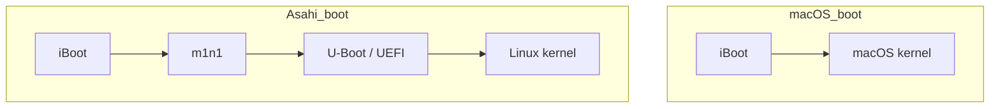

## 0. はじめに

### 性能が厳しくなってきた(らしい)初期Apple Silicon達

突然ですが、最近AppleがM5とM1を比較したニュースを公開したのはご存知でしょうか。
https://www.apple.com/newsroom/2025/10/apple-unveils-new-14-inch-macbook-pro-powered-by-the-m5-chip/

>14-inch MacBook Pro with M5 delivers:
> 
>  Up to 7.7x faster AI video-enhancing performance in Topaz Video when compared to the 13‑inch MacBook Pro with M1, and up to 1.8x faster than the 14-inch MacBook Pro with M4.1
>  Up to 6.8x faster 3D rendering in Blender when compared to the 13‑inch MacBook Pro with M1, and up to 1.7x faster than the 14-inch MacBook Pro with M4.1
>  Up to 3.2x higher frame rates in games when compared to the 13-inch MacBook Pro with M1,3 and up to 1.6x faster than the 14-inch MacBook Pro with M4.2
>  Up to 2.1x faster build performance when compiling code in Xcode when compared to the 13‑inch MacBook Pro with M1, and up to 1.2x faster than the 14-inch MacBook Pro with M4.1

正直、私はM2のMac Book Airを使っていますがまだまだ現役です。多分M1もまだまだ使えるんだろうなとは思います。
とはいえApple Siliconに移行してからのMacはコスパが最高なので今後も売れて続いて欲しいですよね。買い支えたい。

### Linux化しよう

問題は「新しいMacを買ったら今のMacはどうするのか」という話です。
これについて、型落ちのPCでやることは昔から決まっています。

そう、Linux化です。

というわけで、今年もLinuxデスクトップ元年です。

### せっかくなら「僕の考えた最強のLinuxデスクトップ」を作ろう

型落ちPCのLinux化というと、とにかく軽量なディストリビューションを入れがちですが、Apple Siliconはまだまだ戦えます。

せっかくなら普段使いしたくなるようなリッチなデスクトップ環境を作りませんか？

本記事では、実際にWindowsやMacOSに比べて明確に差別化できるメリットのある環境づくりを目指します。


*僕の考えた最強のLinuxデスクトップ*


:::message
本記事で紹介するのは、環境づくりの土台までです。実際にカスタマイズしてリッチにしていくところまでは書いてません。
今はニッチなことも生成AIが十分に答えてくれるので、土台さえ作れたらきっと後はなんとかなります。
:::

---

## 1. Asahi Linux

いきなりですが、Apple Silicon MacのLinux化にはAsahi Linuxの導入が必須です。

Asahi LinuxはApple SiliconにLinuxを移植するオープンソースプロジェクトです。
ややこしいのですが、Asahi Linuxというディストリビューションがあるわけではありません。あくまでApple SiliconのLinux対応を進めるプロジェクトの名前です。

Asahi Linuxの基本的な思想として**上流志向**というものがあります。
つまりAsahi LinuxはLinuxカーネルなどの上流にどんどん修正を入れていて、将来的にはAsahi Linuxというものを意識しなくともAplle Silicon MacでLinuxが使える世界を目指しています。

とはいえ、今日の時点ではまだ、Asahi Linuxの提供する成果物を明示的に導入しないとMacのLinux化はできません。

ざっくりいうと下の対応が必要です。本記事では導入手順の前にこの2つをまず解説します。

- ブートプロセスの編集
- Asahi Linux対応なディストリビューションの用意

### ブートプロセスについて

Apple Silicon Macは既定ではMacOSしか起動しません。まずブートプロセスに手を入れる必要があります。

#### MacとAsahi Linuxのブートプロセスのイメージ

OSに関わる世界以外を省略するとこんなイメージです。



#### iBoot

前提としてApple Silicon MacはBIOSやUEFIのような共通規格に則ってブートしてません。
ファームウェアを何層か経てまずiBootが起動され、それがMacOSをブートします。
iBootは通常、MacOSのカーネルのみを起動しますが、事前に許可しておくことで後述するm1n1を起動できるようになります。

#### m1n1

後述するU-Bootを起動するため必要なレイヤーです。あとはハードウェアのセットアップとかもしてるらしい。

#### U-Boot

世にあるLinuxディストリビューションは基本的にUEFI規格での起動を期待しているため、ARMで動かせるUEFI互換なブートローダとしてU-Bootを用います。


#### 必要なこと

つまり、ブートプロセスをLinux対応するにあたって以下が必要です。

- m1n1, U-Bootを導入する
- iBootがm1n1をブートするように許可する

難しそうに聞こえるかもしれませんがAsahi Linuxのインストーラが全部やってくれます。

### ディストリビューションについて

ブートプロセスに引き続き、ディストリビューション側にもApple Silicon対応が必要です。

#### Asahi Linux環境で動作するディストリビューションについて

Asahi LinuxがカーネルにApple Silicon対応を入れているとはいえ、ユーザランド側の対応も必要です。

これが満たされているディストリビューションの代表格は、`Fedora Asahi Remix`です。
Asahi Linux自らメンテしているディストリビューションで、Asahi Linux自体のインストーラからそのまま導入できます。

他にも、有志でAsahi Linux対応がされているディストリビューションがあり、下にまとまってます。

https://leo3418.github.io/asahi-wiki-build/swalternative-distros/

本記事ではタイトルにある通りNixOSというディストリビューションを使います。

---

## 2. NixOS, Hyprland採用のモチベーションについて

タイトルにある通り、本記事ではNixOS, Hyprlandの環境を作っていきます。

それぞれを選ぶ動機を、筆者のLinuxディストリビューションについての考え方から紹介します。

### Linuxディストリビューションとは パッケージマネージャ編

そもそもLinuxディストリビューションって何、という話です

ディストリビューションがなんであれLinuxカーネルは共通です。Ubuntu上で他のLinuxディストリビューションのDockerコンテナが動いたりしますよね。
ただ、Linuxカーネルは直接叩かれるものではありません、glibcなどを介してカーネルAPIを呼び出します。
じゃあ、このglibcがディストリビューションの正体なのかというと、それも違います。glibcもディストリビューションによって違いはありません。

ディストリビューションによって生まれる差異は、glibcなどのライブラリをどうやってセットアップしているかです。

Linuxを普段使いまでしていなくとも、仕事でちょっと触るときにDebian系なのかRHEL系なのかは意識することがあると思います

ざっくりいえば、aptならDebian系、rpmならRHEL系みたいな話です。この差分こそがパッケージマネージャの差で、Linuxディストリビューションの本質の一つと言えるのではないかと思います。

#### Nix OSとは

そんなパッケージマネージャの話を踏まえて、本記事で扱うNix OSの紹介をします。

Nix OSはその名の通り、Nixというビルドシステム兼パッケージマネージャを用いています。
Nixは特徴的なパッケージマネージャで、都度都度`nix install curl`みたいなことはしません[^1]。

ではどうやってアプリケーションを導入するかというと、構成を純粋関数型言語であるnix言語で記述します。そのnixファイルの記載に基づいて、環境がデプロイされます。
必要なアプリケーションがあるなら、nixファイルに書かないといけないし、nixファイルに書いてないアプリケーションは環境に(基本的に)存在できません。

(ちなみに関数型言語の経験はなくても大丈夫です。私はAIに聞きながら雰囲気で書いてます。)

curlを導入するnixファイルの例
```nix
{ config, pkgs, ... }:

{
  environment.systemPackages = with pkgs; [
    curl
  ];
}

```

さらにはアプリケーションだけではなく、ホスト名やユーザ名まですべてをコードに記述します。
OS as Codeと表現されていることも見かけます。

そんな特徴を持つNixですが、[公式サイト](https://nixos.org/)では以下の3つをアピールしています。

 - Reproducible(再現性)
 - Declarative(宣言的)
 - Reliable(信頼性)

詳しい話はNixで検索するとたくさん記事が出てくるので、それぞれ実践的に何が嬉しいのかだけざっくり紹介します

##### Reproducible(再現性)

再現性に関してもっとも嬉しい点は、依存関係のlockファイルが作られることです[^2]。

uv, pnpm, Cargoなど、ランタイムのパッケージマネージャの世界ではlockファイルが当たり前になりつつありますよね。
開発, 検証, 本番で全く同じ依存ツリーでパッケージが解決されるのは本当に素晴らしいです。

ところが、OSのパッケージマネージャには一般的にlockファイルがありません。
例えば、あなたがaptやbrewでほしいアプリケーションをバージョン指定込みで一括インストールするスクリプトを用意していたとしても、依存関係には再現性はないです。

NixOSなら、OSのパッケージマネージャでもlockファイルを用意できます。どこのマシンでも全く同じ環境が用意できます。

実際、私の環境でcurlのバイナリを探してみると複数あり、各パッケージが厳密な依存関係をもってcurlを使っていることがわかります。

```bash
❯ ls -d /nix/store/*curl-*-bin
 /nix/store/0gmdkrx09gwjzy9skah4v6makk136ypy-curl-8.16.0-bin
 /nix/store/qnakzidljavpz27az7gjkyydb7ckjg6r-curl-8.16.0-bin
 /nix/store/xjyd8czibdxvwqyh7ybnh300cykzis3g-curl-8.14.1-bin
```

##### Declarative(宣言的)

先述の通りNixOSは都度都度アプリケーションをインストールするコマンドを叩くのではなく、純粋関数型言語で構成を記述します。
手動でオンデマンドなインストールと比較すればもちろんですが、インストールやシンボリックリンクの生成を手続き的に行うシェルスクリプト製のdotfilesに比べても宣言的と言えそうです。

##### Reliable(信頼性)

仮に誤った構成でシステムに不具合が起きても、NixOSのでは前回の構成がキャッシュされているので復元できます。
復元と聞くとスナップショットのようなストレージを大量に消費するようなものをイメージするかもしれませんが、実際にはNix式と成果物のキャッシュから状態を復元をしています。
結果が予測可能な純粋関数型のパッケージマネージャだからこそできる技です。

##### サプライチェーン攻撃への耐性

上記3つのメリットに加えて、もう一つ個人的にアツいと思っているのは最近話題のサプライチェーン攻撃への耐性です。

- バイナリの差し替えが検知できる
  - nixはビルドシステムを兼ねており、純粋関数型であるのでビルド結果が決定的で事前にファイルハッシュまで予測可能です。なので、バイナリが差し替えられたらその時点でハッシュの不一致から依存の解決に失敗します。
- リポジトリが分散管理
  - サプライチェーン攻撃の被害が広がる要因の一つにリポジトリが中央集権で攻撃への対応が遅れるとというものがあるそうですが、Nixは分散管理です。

### Linuxディストリビューションとは デスクトップ環境編

Linuxディストリビューションを形作る大きな要素の一つにパッケージマネージャがあるという話をしましたが、もう一つわかりやすいものがあります。
デスクトップ環境(Desktop Environment, DE)です。
例えばUbuntuはフレーバとして、LubuntuやKubuntu, Mintなど様々な派生のディストリビューションがあります。これらは当然Debian系なのでどれもパッケージマネージャはaptですが、明確な差がありそれがDEです。
デスクトップがリッチだったり軽量だったりWindows, MacOS風だったりなどで様々なものがあります。

DEというのはウィンドウマネージャやタスクバー、通知機能など様々なものをあわせたものを指し、Gnome, KDEなどが有名です。
当然。自分で各要素を組み合わせて作ることもできます。極論組み合わせなくともウィンドウマネージャさえあれば使えます。
本記事ではおすすめのウィンドウマネージャとしてHyprlandを紹介します[^3]。

#### Hyprlandとは

GUIの話なのでまず公式のこの動画を見るとイメージが伝わると思います。

https://hypr.land/videos/outfoxxed.mp4

[公式サイト](https://hypr.land/)では特徴として以下がアピールされています。

- Smooth
- Easy to Configure
- Dynamic tiling

最初2つの滑らかで設定が簡単というのは、人気のあるウィンドウマネージャなら大抵そうだと思うので、3つ目について解説します。

#### タイル型ウィンドウマネージャとは

ウィンドウ管理の方式として主要なものに以下の2つがあります。

- スタック型
- タイル型


*ChatGPT作*

スタック型はMacOSやWindowsで用いられている方式で、皆さんも普段使われていると思います。
ブラウザを開いているときにコンソールを開くとブラウザの上にコンソールが重なって起動しますよね。それがスタック型です。

タイル型は重なりません、多くのタイル型では動的タイリングが採用されており、ブラウザの起動中にコンソールを開くと自動で画面の半々にブラウザとコンソールが配置されます。
もちろんそのままだとすぐに画面がパンパンになるので、スタック型よりも積極的にワークスペース(Windowsで言う仮想デスクトップ)機能を用います。

個人的に、今日のモニタは十分に解像度が高いので、ウィンドウをわざわざ重ねるような挙動は微妙な気がしてタイル型を使っています。
タイル型ウィンドウマネージャのためにLinuxデスクトップを使っていると言っても過言ではないです。
(WindowsやMacOSにもタイル型を実現するツールはありますが、ベースがスタック型なのでどこか歪な挙動になりがちで諦めました)


---

## 3. 導入前に

背景の話が終わったのでいざ導入ですが、その前に。

### 筆者の環境

Apple MacBook Air (13-inch, M2, 2022)

### 対応機種

- M1, M2, M3いずれかのApple Silicon Mac

### 背景知識、やることのまとめ

- Apple Silicon MacにAsahiLinuxを導入して、UEFI互換なブート環境を用意する
- Nix OSを導入し、再現性と信頼性ののある宣言的なパッケージ管理を行う
- Hyprlandでデスクトップ環境を構築し、タイル型ウィンドウマネージャを導入する


### リスク

壊れても良い状態にしてからやりましょう

:::message alert
* パーティション操作とかミスると文鎮化します。レスキューモードとかもないです。
* やらかしたらもう一台Macを買って専用のツールで復旧することになります。(一敗)
    詳しくは↓
    https://support.apple.com/ja-jp/108900
:::

### 必要なもの

いずれもMac Bookならtype-cである必要があります。

- USBメモリ
- 有線LANアダプタ


前者は多分必須です。後者はnmcliやiwctlを用いたWifi接続で代替できますが、この記事では紹介しません。
どうしても有線LANのアダプタを用意できない場合はそれらのhelpを見たりググってみたりしてください。

---

## 4. Asahi インストーラを使った導入

Asahi LinuxはMacOSの世界からインストーラを実行して導入します。
UEFIとかBIOSとか触らなくともセットアップできるということです(そもそもどっちもない)。
技術スタック的にはややこしくなってますが、導入する分にはintel時代より楽にデュアルブート環境が組めると言えそうです。
(私はintel時代のMac触ったことないですが)


:::message
4, 5章の手順は、NixOSのAsahi Linux対応を行っているコミュニティが公開している手順をログやスクショ付きで書き起こしただけのものです。
基本的に↓のドキュメントを見て、詰まったらこの記事の手順を見るのをおすすめします。

[nix-communityによる導入手順](https://github.com/nix-community/nixos-apple-silicon/blob/main/docs/uefi-standalone.md)
:::


### 事前準備: NixOSのインストールメディアの作成

Assahi Linuxをセットアップする前にまずNixOSのインストールメディアを作っておきます。

ここからAppleSilicon対応なNixOSのISOを落とせます。ddかrufasか何かでUSBに焼いておきましょう

https://github.com/nix-community/nixos-apple-silicon/releases

### Asahi Linuxのセットアップ

とりあえずこんな感じでインストーラを実行しましょう

~~~bash
curl https://alx.sh | sh
~~~

するといろいろ出力が出ますが、Enterを押せと言われるので押しましょう

~~~bash
  % Total    % Received % Xferd  Average Speed   Time    Time     Time  Current
                                 Dload  Upload   Total   Spent    Left  Speed
100  2293    0  2293    0     0    898      0 --:--:--  0:00:02 --:--:--   899
Bootstrapping installer:
  Checking version...
  Version: v0.7.7
  Downloading...
  Extracting...
  Initializing...
The installer needs to run as root.
Please enter your sudo password if prompted.
Welcome to the Asahi Linux installer!
This installer will guide you through the process of setting up
Asahi Linux on your Mac.
Please make sure you are familiar with our documentation at:
  https://alx.sh/w
Press enter to continue.
~~~

システムの構成をインストーラが調べてくれます。Mac用のパーティションしかないよ、と言われるはずなのでLinuxのためにMacの領域を縮めましょう。
rでリサイズが始まります。

~~~bash
Collecting system information...
  Product name: MacBook Air (M2, 2022)
  SoC: Apple M2
  Device class: j413ap
  Product type: Mac14,2
  Board ID: 0x28
  Chip ID: 0x8112
  System firmware: iBoot-11881.140.96
  Boot UUID: xxxxxxxx-xxxx-xxxx-xxxx-xxxxxxxxxxxx
  Boot VGID: xxxxxxxx-xxxx-xxxx-xxxx-xxxxxxxxxxxx
  Default boot VGID: xxxxxxxx-xxxx-xxxx-xxxx-xxxxxxxxxxxx
  Boot mode: macOS
  OS version: 15.6.1 (24G90)
  OS restore version: 24.7.90.0.0,0
  Main firmware version: 15.6.1 (24G90)
  No Fallback System Firmware / rOS
  SFR version: 24.7.90.0.0,0
  SystemRecovery version: 24.7.90.0.0,0 (15.6.1 24G90)
  Login user: yourname
Collecting partition information...
  System disk: disk0
Collecting OS information...
Partitions in system disk (disk0):
  1: APFS [Macintosh HD] (499.75 GB, 6 volumes)
    OS: [B ] [Macintosh HD] macOS v15.6.1 [disk3s1s1, xxxxxxxx-xxxx-xxxx-xxxx-xxxxxxxxxxxx]
  [B ] = Booted OS, [R ] = Booted recovery, [? ] = Unknown
  [ *] = Default boot volume
Using OS 'Macintosh HD' (disk3s1s1) for machine authentication.
Choose what to do:
  r: Resize an existing partition to make space for a new OS
  q: Quit without doing anything
» Action (r): r
~~~

今度はMac用の領域をどのぐらい残すか聞かれます。`Minimum new size: 63.76 GB (12.76%)`が重要で、指定できる最小サイズです。
これはあなたがどのぐらいストレージを積んでいるか、消費しているかによって数字が異なるでしょう。
多少はバッファを持たせておいたほうが良いと思います、私は最小12%に対して15%を指定しておきました。

~~~bash
We're going to resize this partition:
  APFS [Macintosh HD] (499.75 GB, 6 volumes)
  Total size: 499.75 GB
  Free space: 473.99 GB
  Available space: 435.99 GB
  Overhead: 0 B
  Minimum new size: 63.76 GB (12.76%)
Enter the new size for your existing partition:
  You can enter a size such as '1GB', a fraction such as '50%',
  or the word 'min' for the smallest allowable size.
  Examples:
  30%  - 30% to macOS, 70% to the new OS
  80GB - 80GB to macOS, the rest to your new OS
  min  - Shrink macOS as much as (safely) possible
» New size (50%): 15%
~~~

しばらく固まるよ、と言われます。問題なければyで続行。

~~~bash
Resizing will free up 424.79 GB of space.
Note: your system may appear to freeze during the resize.
This is normal, just wait until the process completes.
» Continue? (y/N): y
~~~

ログがたくさん出てきますが、終わるとenterを押すよう促されます。押しましょう。

~~~bash
Started APFS operation

---略---

Finished APFS operation
Resize complete. Press enter to continue.
~~~

システム情報が再収集されました。さっきはMacの領域しかないよ、と言われましたが今度は`2: (free space: 424.79 GB)`がありますね。
さっきはなかった`f: Install an OS into free space`でここをAsahi Linuxの領域にできます。

~~~bash
Collecting partition information...
  System disk: disk0
Collecting OS information...
Partitions in system disk (disk0):
  1: APFS [Macintosh HD] (74.96 GB, 6 volumes)
    OS: [B ] [Macintosh HD] macOS v15.6.1 [disk3s1s1, xxxxxxxx-xxxx-xxxx-xxxx-xxxxxxxxxxxx]
  2: (free space: 424.79 GB)
  [B ] = Booted OS, [R ] = Booted recovery, [? ] = Unknown
  [ *] = Default boot volume
Using OS 'Macintosh HD' (disk3s1s1) for machine authentication.
Choose what to do:
  f: Install an OS into free space
  r: Resize an existing partition to make space for a new OS
  q: Quit without doing anything
» Action (f): f
~~~

今度は何をインストールするか聞かれます。とりあえず動くLinuxがほしい形は1,2にを選ぶと立派なFedora環境がすぐに手に入ります。
本記事では先に紹介したNixOSを使いたいので5を選んで、AsahiLinuxの基盤だけセットアップします。

```bash
Collecting partition information...
  System disk: disk0
Collecting OS information...
Partitions in system disk (disk0):
  1: APFS [Macintosh HD] (74.96 GB, 6 volumes)
    OS: [B ] [Macintosh HD] macOS v15.6.1 [disk3s1s1, xxxxxxxx-xxxx-xxxx-xxxx-xxxxxxxxxxxx]
  2: (free space: 424.79 GB)
  [B ] = Booted OS, [R ] = Booted recovery, [? ] = Unknown
  [ *] = Default boot volume
Using OS 'Macintosh HD' (disk3s1s1) for machine authentication.
Choose what to do:
  f: Install an OS into free space
  r: Resize an existing partition to make space for a new OS
  q: Quit without doing anything
» Action (f): f
Choose an OS to install:
  1: Fedora Asahi Remix 42 with KDE Plasma
  2: Fedora Asahi Remix 42 with GNOME
  3: Fedora Asahi Remix 42 Server
  4: Fedora Asahi Remix 42 Minimal
  5: UEFI environment only (m1n1 + U-Boot + ESP)
» OS: 5
```

OSの名前を聞かれます。電源ボタン長押ししたときのメニューとか表示される名前で、振る舞いには影響しません。適当に決めましょう。

:::message
ここで指定しているのはあくまでブートメニューで見せる名前です。
ややこしいですがあくまでAsahi Linuxのセットアップをしているだけで、NixOSそのものはまだ登場しません。
:::


```bash
Downloading OS package info...
- 
Minimum required space for this OS: 3.00 GB
Available free space: 424.79 GB
Enter a name for your OS
» OS name (UEFI boot): NixOS
```

レポートを送るか聞かれます、是非yでAsahi Linuxに貢献しましょう。

```bash
Using macOS 13.5 for OS firmware
Downloading macOS OS package info...

---略---

Installation successful!
Install information:
  APFS VGID: xxxxxxxx-xxxx-xxxx-xxxx-xxxxxxxxxxxx
  EFI PARTUUID: xxxxxxxx-xxxx-xxxx-xxxx-xxxxxxxxxxxx
Help us improve Asahi Linux!
We'd love to know how many people are installing Asahi and on what
kind of hardware. Would you mind sending a one-time installation
report to us?
This will only report what kind of machine you have, the OS you're
installing, basic version info, and the rough install size.
No personally identifiable information (such as serial numbers,
specific partition sizes, etc.) is included. You can view the
exact data that will be sent.
Report your install?
  y: Yes
  n: No
  d: View the data that will be sent
» Choice (y/n/d): y
```

シャットダウン後の手順が表示されます。よく読んでからEnterを押しましょう。
電源落ちてからしばらく待ったら、電源ボタン長押し、ブートメニューがでたらNixOS(さっき指定したOS名)を起動してねと書いてます。

```bash
Your install has been counted. Thank you! ❤
To be able to boot your new OS, you will need to complete one more step.
Please read the following instructions carefully. Failure to do so
will leave your new installation in an unbootable state.
Press enter to continue.
When the system shuts down, follow these steps:
1. Wait 25 seconds for the system to fully shut down.
2. Press and hold down the power button to power on the system.
   * It is important that the system be fully powered off before this step,
     and that you press and hold down the button once, not multiple times.
     This is required to put the machine into the right mode.
3. Release it once you see 'Loading startup options...' or a spinner.
4. Wait for the volume list to appear.
5. Choose 'NixOS'.
6. You will briefly see a 'macOS Recovery' dialog.
   * If you are asked to 'Select a volume to recover',
     then choose your normal macOS volume and click Next.
     You may need to authenticate yourself with your macOS credentials.
7. Once the 'Asahi Linux installer' screen appears, follow the prompts.
If you end up in a bootloop or get a message telling you that macOS needs to
be reinstalled, that means you didn't follow the steps above properly.
Fully shut down your system without doing anything, and try again.
If in trouble, hold down the power button to boot, select macOS, run
this installer again, and choose the 'p' option to retry the process.
Press enter to shut down the system.
```

電源を長押しするとこんな画面になります、NixOSをを選びましょう。


起動してNixOSを選ぶとコンソールが表示されこんな出力になります。とりあえずEnterを押しましょう。
この状態が何なのかはよくわかってないですが、まだMacOSの世界なのでここから実際にm1n1やU-Bootのセットアップなどが始まります。
※ここからは写真をChatGPTに文字起こししてもらったものなので若干不正確です。

```bash
Asahi Linux installer (second step)

VGID: xxxxxxxx-xxxx-xxxx-xxxx-xxxxxxxxxxxx
System volume: /Volumes/NixOS

You will see some messages advising you that you are changing the
security level of your system. These changes apply only to your
Asahi Linux install, and are necessary to install a third-party OS.

Apple Silicon platforms maintain a separate security level for each
installed OS, and are designed to retain their security with mixed OSes.
The security level of your macOS install will not be affected.

You will be prompted for login credentials two times.
Please enter your macOS credentials (for the macOS that you
used to run the first step of the installation).

Press enter to continue.
```

ユーザ名とパスワードを入力します。MacOSの認証情報です。


```bash
Operating on Volume Group UUID xxxxxxxx-xxxx-xxxx-xxxx-xxxxxxxxxxxx

This utility is not meant for normal users or even sysadmins.
It provides unabstraced access to capabilities which are normally handled for t
he user automatically when changing the security policy through GUIs such as the
Startup Security Utility in macOS Recovery ("recoveryOS").
It is possible to make your system security much weaker and therefore easier to
compromise using this tool.
This tool is not to be used in production environments.
It is possible to render your system unbootable with this tool.
It should only be used to understand how the security of Apple Silicon Macs work
s.
Use at your own risk!

Authorized user: yourname
Password:
```

セキュアブート的なものを緩めると言われてます。問題なければy

```bash

---略---

Kernel CTRR Status:             Disabled (sip2): 1
Boot Args Filtering Status:     Enabled (sip3): absent

By setting a custom boot object, you will be putting your system into Permissive Security.
Are you sure you want to do this? (enter y or n) y
```

m1n1をブート可能に登録するため、もう一度ユーザ名とパスワードを聞かれます。入力するとrebootを促されます。


```bash
found raw boot object, deriving Mach-O boot properties...
wrapping boot object payload...
going to change bootpolicy to permissive...
updating local machine policy...
Username: yourname
[Password:
installing boot object...
done.

Wrapping up...

Installation complete! Press enter to reboot.
```

再起動後、こんな感じの画面になってれば無事m1n1→U-Bootが起動できてます。

```bash
U-Boot 2023.07-rc2 (Dec 20 2023 - 05:31:57 +0000)

Model: Apple MacBook Air (13-inch, M2, 2022)

---略---

Device 0: unknown device
=>
```

これでAsahiLinuxの導入は完了です。これでUEFIを期待するLinuxを起動できるようになりました。

---

## 5. Nix OSのインストール

事前に用意しておいたインストールメディアでNixOSのインストールをしていきます。

USBを指した状態でU-Bootのコンソールに`usbboot`と打てばUSBの中身がブートされます。

```bash
U-Boot 2023.07-rc2 (Dec 20 2023 - 05:31:57 +0000)

Model: Apple MacBook Air (13-inch, M2, 2022)

---略---

Device 0: unknown device
=>usbboot
```

こんな画面になるのでEnterを押すとインストーラが起動します。


::: message
安物のtype-c変換をアダプタを使っている場合は接続がブツブツ切れるかもしれません。
切れるとやり直しなので、そのような場合は`Options`から`Copy ISO Files to RAM`を選択しましょう。
:::

先ほどAsahi LinuxのインストーラでMacOSのの領域を縮めましたが、空き領域にはまだm1n1やU-bootが置かれただけです。
NixOSのために、空き領域をほぼ全部使ってパーティションを作ります。

```bash
[nixos@nixos:~]$ sudo sgdisk /dev/nvme0n1 -n 0:0:-8
The operation has completed successfully.
```

そしてパーティション一覧を確認すると、直近のコマンド作成したパーティションが5だとわかります。ここにNixOSををインストールしていきます。
(明確な基準はないですが、デバイスにの持ってるストレージ容量から、AsahiLinuxのインストーラで縮めたMacOSのサイズを引いたぐらいのやつ)

```bash
[nixos@nixos:~]$ sudo sgdisk /dev/nvme0n1 -p
Disk /dev/nvme0n1: 122138123 sectors, 465.9 GiB
Model: APPLE SSD AP0512Z
Sector size (logical/physical): 4096/4096 bytes
Disk identifier (GUID): FCFBC853-8E8A-44C2-AD85-1FEBD131C1F8
Partition table holds up to 128 entries
Main partition table begins at sector 2 and ends at sector 5
First usable sector is 6, last usable sector is 122138127
Partitions will be aligned on 2-sector boundaries
Total free space is 3 sectors (12.0 KiB)

Number  Start (sector)   End (sector)    Size       Code  Name
   1              6        128005        500.0 MiB  AF0B  iBootSystemContainer
   2         128006      18429701         69.8 GiB  AF0A  Container
   3       18429702      19040005          2.3 GiB  AF0A
   4       19040006      19162117        477.0 MiB  EF00
   5       19162118     122138127        392.8 GiB  8300

```

新規作成したパーティションをext4でフォーマットします。

:::message alert
あくまで私の環境では`/dev/nvme0n1p5`だっただけです。ここをミスると文鎮化します。
直前の`sgdisk /dev/nvme0n1 -p`の出力をよく確認し、慎重に操作してください。
:::


```bash
[nixos@nixos:~]$ sudo mkfs.ext4 -L nixos /dev/nvme0n1p5
mke2fs 1.47.2 (1-Jan-2025)
Discarding device blocks: done
Creating filesystem with 102976008 4k blocks and 25774165 inodes
Filesystem UUID: 51f1643a-ac39-4c48-a8b5-57a8c8d8d4f5
Superblock backups stored on blocks:
        32768, 98304, 163840, 229376, 294912, 819200, 884736, 1605632, 2654208,
        4096000, 7962624, 11239424, 20480000, 23887872, 71663616, 78675968,
        102400000

Allocating group tables: done
Writing inode tables: done
Creating journal (262144 blocks): done
Writing superblocks and filesystem accounting information: done
```

領域を確保できたので実際にインストールしていきますが、一旦rootになっておきましょう。


```bash
sudo -i
```

efi領域を`/mnt/boot`にマウントします。ここの意味正直よくわかってないです。
Asahi Linux特有の構成をNixOSのインストーラが期待する一般的な構成として見せるためにやってる？
最後のコマンドの警告は無視して良いです。


```bash
[root@nixos:~]# mount /dev/disk/by-label/nixos /mnt

[root@nixos:~]# mkdir -p /mnt/boot

[root@nixos:~]# mount /dev/disk/by-partuuid/`cat /proc/device-tree/chosen/asahi,efi-system-partition` /mnt/boot/
-bash: warning: command substitution: ignored null byte in input
```

NixOSでは構成をnixファイルに記述すると述べましたが、そのための雛形のファイルを作ります。
あとインストーラに同梱されているAppleSilicon対応のためのnixファイルも雛形のところにコピーします。

```bash
[nix-shell:~]# nixos-generate-config --root /mnt
writing /mnt/etc/nixos/hardware-configuration.nix...
writing /mnt/etc/nixos/configuration.nix...
For more hardware-specific settings, see https://github.com/NixOS/nixos-hardware.

[nix-shell:~]# cp -r /etc/nixos/apple-silicon-support /mnt/etc/nixos/

[nix-shell:~]# chmod -R +w /mnt/etc/nixos/
```

上の手順で`nixos-generate-config`によってnixファイルの雛形を作り同階層にapple-silicon対応をコピーしましたが、現状はコピーしたファイルが参照してもらえません。
`/mnt/etc/nixos/configuration.nix`がエントリポイントです、そこにapple-silicon対応のファイルパスを追記しましょう。
それと、`boot.loader.efi.canTouchEfiVariables`というのをfalseにする必要があります。こっちの理屈はよくわかりませんがドキュメントにそう書いてます。
> [Add the `./apple-silicon-support` directory to the imports list and switch off the `canTouchEfiVariables` option.](https://github.com/nix-community/nixos-apple-silicon/blob/e01011ebc0aa7a0ae6444a8429e91196addd45f4/docs/uefi-standalone.md?plain=1#L216)

インストーラの環境ではnanoしか入ってないのでnanoで上記の修正を行います。


```bash
[nix-shell:~]# nano /mnt/etc/nixos/configuration.nix
```

ここに追記します。

```diff
/mnt/etc/nixos/configuration.nix

*** 
    imports =
      [ # Include the results of the hardware scan.
        ./hardware-configuration.nix
+       ./apple-silicon-support
      ];

    # Use the systemd-boot EFI boot loader.
    boot.loader.systemd-boot.enable = true;
-   boot.loader.efi.canTouchEfiVariables = true;
+   boot.loader.efi.canTouchEfiVariables = false;
```

これでやっとNixOSをインストールできます。


```bash
[nix-shell:~]# nixos-install
```

NixOSのルートのパスワードを聞かれます。


```bash

---略---

Copied "/nix/store/jiz0bcmhjzxw2k1n1k4w808ynb2f4pj-systemd-257.6/lib/systemd/boot/efi/systemd-bootaa64.efi" -> "/boot/EFI/systemd/systemd-bootaa64.efi"
Copied "/nix/store/jiz0bcmhjzxw2k1n1k4w808ynb2f4pj-systemd-257.6/lib/systemd/boot/efi/systemd-bootaa64.efi" -> "/boot/EFI/BOOT/BOOTAA64.EFI"
!! Mount point '/boot' which backs the random seed file is world accessible, which is a security hole! 
!! Random seed file '/boot/loader/.#bootctl-random-seed1c2411b3db3cf9d' is world accessible, which is a security hole! 
Random seed file '/boot/loader/random-seed' successfully written (32 bytes).
setting up /etc...
setting up root password...
New password:
Retype new password:
```

パスワードを設定すると完了です。再起動しましょう。
これで内蔵ストレージにNixOSをインストールできたので、もうUSBは不要です。


```bash
passwd: password updated successfully
installation finished!
[nix-shell:~]# reboot
```

再起動するとNixOSが起動します。さっき設定したパスワードを使ってrootでログインできます。

```bash
nixos login: root
Password:
```

これでNixOSのインストールは完了です。次はHyprlandの導入ですが、NixOSにパッケージを追加する方法を先に紹介しておきます。

`/etc/nixos/configuration.nix`というファイルがあると思いますが、これがエントリポイントです。初期構成ではこれがほぼ全てなのでこれを編集してシステムを構成していくことになります。
このファイルには元からvimとwgetを追加する設定例のコメントがあるので、コメントアウトを解除してみましょう。

```bash
[nix-shell:~]# vim /etc/nixos/configuration.nix
```

70行目あたりを編集します。

```diff
/etc/nixos/configuration.nix

   # List packages installed in system profile.
   # You can use https://search.nixos.org/ to find more packages (and options).
-  # environment.systemPackages = with pkgs; [
-  #   vim # Do not forget to add an editor to edit configuration.nix! The Nano editor is also installed by default.
-  #   wget
-  # ];
+  environment.systemPackages = with pkgs; [
+    vim # Do not forget to add an editor to edit configuration.nix! The Nano editor is also installed by default.
+    wget
+  ];

   # Some programs need SUID wrappers, can be configured further or are
   # started in user sessions.
```

即反映されるわけではないので、以下のコマンドで構成を適用しましょう。

```bash
[nix-shell:~]# nixos-rebuild switch
```

コマンドが終わるとvimがインストールされてるはずです、もちろん使うこともできます。

```bash
[root@nixos:~]# which vim
/run/current-system/sw/bin/vim
```

Nixではこんなふうに構成ファイルに必要なアプリケーションを記述していく必要があります。
最初は面倒に感じるかもしれませんが、管理コストが大きく下がります。

---

## 6. Hyprlandの導入

GUIの世界を作る前にまずは一般ユーザを追加しましょう。
例のごとくユーザ追加の例も雛形に載ってるので、コメントアウトを解除するだけです。
ただ、ユーザ名はサンプルだとaliceになってるので適宜変更してください。

また、userの中のpackagesにはユーザごとに使うアプリケーションを追加できます。
さっきvimやwgetを追加した`environment.systemPackages`はシステム全体で使えるアプリケーションですが、こっちはそのユーザのみ使えます。
ここにkittyとfirefoxを追加しておきましょう。kittyはHyprland推奨のターミナルエミュレータです。iTermとかWindows Terminalみたいなやつ。

```bash
[nix-shell:~]# vim /etc/nixos/configuration.nix
```

65行目あたりをこんな感じに。

```diff
/etc/nixos/configuration.nix

   # Enable touchpad support (enabled default in most desktopManager).
   # services.libinput.enable = true;

   # Define a user account. Don't forget to set a password with ‘passwd’.
-  # users.users.alice = {
-  #   isNormalUser = true;
-  #   extraGroups = [ "wheel" ]; # Enable ‘sudo’ for the user.
-  #   packages = with pkgs; [
-  #     tree
-  #   ];
-  # };
+  users.users.<yourname> = {
+    isNormalUser = true;
+    extraGroups = [ "wheel" ]; # Enable ‘sudo’ for the user.
+    packages = with pkgs; [
+      tree
+      kitty
+      firefox
+    ];
+  };

   # programs.firefox.enable = true;

   # List packages installed in system profile.
   # You can use https://search.nixos.org/ to find more packages (and options).
```

今度はいよいよHyprlandの導入です。


```bash
[nix-shell:~]# vim /etc/nixos/configuration.nix
```

`programs.hyprland.enable = true;`と書きましょう。シンタックスが壊れなければファイルのどこに書いても良いです。
vimやfirefoxなど、これまで追加してきたアプリケーションと書き方が違います。
これはバイナリにPATHを通すだけではなく、いろいろと必要なセットアップをまとめてしてくれるモジュールを呼んでいるためです。


```diff
/etc/nixos/configuration.nix

   environment.systemPackages = with pkgs; [
     vim # Do not forget to add an editor to edit configuration.nix! The Nano editor is also installed by default.
     wget
   ];

+  programs.hyprland.enable = true;
+
   # Some programs need SUID wrappers, can be configured further or are
   # started in user sessions.
   # programs.mtr.enable = true;
   # programs.gnupg.agent = {
   #   enable = true;
```

`nixos-rebuild switch`で適用。

```bash
[nix-shell:~]# nixos-rebuild switch
```

さっき作ったユーザですが、パスワードがないとログインできないので設定しておきましょう。

```
[nix-shell:~]# passwd <yourname>
Enter new UNIX password:
Retype new UNIX password:
```

再起動


```bash
[nix-shell:~]# reboot
```

こんどはさっき作った一般ユーザで入りましょう。

```bash
nixos login: <yourname>
Password:
```

いざHyprlandを起動すると、こんな画面になるはずです。

```bash
[<yourname>@nixos:~]$ hyprland
```


Command + Qでコンソールを起動呼び出せます(さっき追加したkitty)。
コンソールで`firefox &`すればブラウザも立ち上がります。


ブラウザが解禁されもちろんクリップボードも使える状態です。
あとは生成AIに聞いたりしながら自由にカスタマイズしていってください。
お疲れ様でした！

---

## 7. カスタマイズのヒント

「自由にカスタマイズしてください」で終わるのも忍びないので、優先度が高い作業をざっくばらんに書いておきます。

### hyprland.confの作成

本記事で作ったHyprland環境ですが、よく見ると上部にアラートがあると思います。


これは設定ファイルがないから自動生成のコンフィグで起動してますよ。と言われてます。
[公式のサンプル設定](https://github.com/hyprwm/Hyprland/blob/main/example/hyprland.conf)を持ってきてカスタマイズしたり、 AIにお願いしてvimライクなキーバインドだったり、emacsライクなキーバインドだったりを作ってみましょう。

あと、hyprland.confファイル自体も是非Nixで管理しましょうclaude codeなんかに頼めばサクッととやってくれます。

### flakeの導入

実は本記事で作った環境ではまだlockファイルが作られません。lockファイルを活用するにはflakeという機能を有効化する必要があります。
これは微妙に詰まりがちですが、恩恵が大きいのでぜひ頑張ってみてください。

### タスクバーの導入

時間とか残バッテリーとかが表示される棒です。優先度が低いように感じますが、無いと想像以上に不便です。
waybarがおすすめです。

### 画面ロックの導入

Windowの`Win + L`みたいな画面ロックはほしいですよね。
これをいれると単に画面ロックができるだけでなく、Hyprlandの起動時に問答無用でロックをかけることで起動時のログイン画面を代替できたりして一石二鳥です。~~セキュリティ的には微妙そう~~
hyprlockがおすすめです。

### アプリランチャーの導入

アプリケーションを毎回コンソールから起動するのもしんどいので、ランチャーがほしいです。
rofiがおすすめです。

---

## 8. 終わりに

この記事を作成するにあたって、検証のためにあらためて必要最低限の構成にswitchしたりしたのですが、なんの問題もなく元の環境に帰ってこられました。
やっぱりNixはすごいですね。

なるべく自己RVはしましたが、　それでも記事の中には誤りがあると思います。ご指摘いただければ幸いです。

最後に私のdotfilesを貼っておきます。

https://github.com/ymat19/dotfiles

ここまでお読みいただきありがとうございました！

---

## 参考

こちらはNixデビューするときに何度も読ませていただきました。本記事でも参考にさせていただいてます。

https://zenn.dev/asa1984/articles/nixos-is-the-best
https://zenn.dev/asa1984/books/nix-introduction/viewer/01-introduction

---


[^1]: 実際は都度都度インストールするような機能もありますが、まず使わないと思います
[^2]: flakeという機能を有効化した場合のみlockファイルが作られます
[^3]: 厳密にはHyprlandはウィンドウマネージャではなくwaylandコンポジタです

